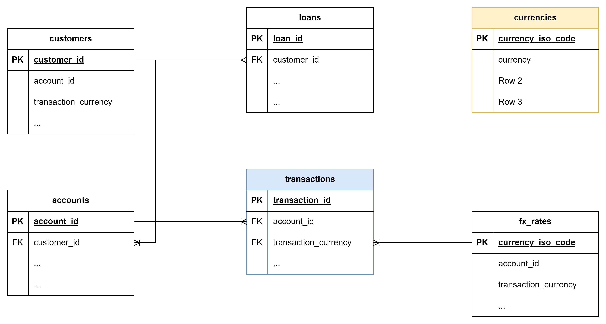

# Case Study at Varengold Bank AG - Data Engineering

## Introduction

Dear applicant,

Thank you for all the work with the study.

The following changes are made:
- For all the fixes, constraints, comments and tests see EXPLORATION.md
- Data enrichment with help of currencies.csv
- I have implemented a few incremental models for the intermediate layer (data warehouse)
- I have created a new model in the reporting layer
- The data catalog is generated here /workspaces/dbt-case/transformation/target/catalog.json

Have a nice day,
Eddie Knuth

[Contact us](mailto:eddie.knuth@t-online.de)

## Case Study

We have a small, normalized data model that contains data about our customers, their accounts and loans, as well as
their transactions in various currencies. The data is artificially and randomly generated. For our case study, we assume
that the data comes from a source database every day and lands in our data warehouse (duckdb: raw). We take this source
and want to load it for our purposes into a data warehouse (duckdb: other schemas). On the way we would like to enrich
our data (./data/currencies.csv), ensure correct data types, enforce relations, keep data quality in check and do
further transformations. We have started our work already (./transformations/models/staging). This is where we need your
help...

 <b> Tasks: </b> 

**Setup:**

1. [X] Please create a repository and commit this content (or clone and change remote)
2. [X] Start running the devcontainer and set up your remote connection

**Exploration:**

- [X] Please showcase an exploration of the provided data and your findings

**Data Loading / Transformation:**

- [X] Please load the provided CSV file to enrich our data
- [X] Please create a materialized table into the reporting schema, that sums up all transactions in EUR (Euro) per
  customer, account, branch and date. To simplify everything, the provided exchange rate table should be used for all
  dates.

**Data Quality / Testing:**

- [X] Please make use of tests. Use dbt's testing functionality to ensure integrity of your models and check for data
  anomalies.

**Data Catalog:**

- [X] Please generate a data catalog

**Submission:**

- [ ] Please send us a link to your repository

### Evaluation Criteria:

- Completeness of data exploration, especially finding all anomalies
- Data model and correctness of reporting table
- Robustness of tests and validations

### ERD (DuckDB: raw)

The entity-relationship diagram shows how the individual source tables are related to each other.

