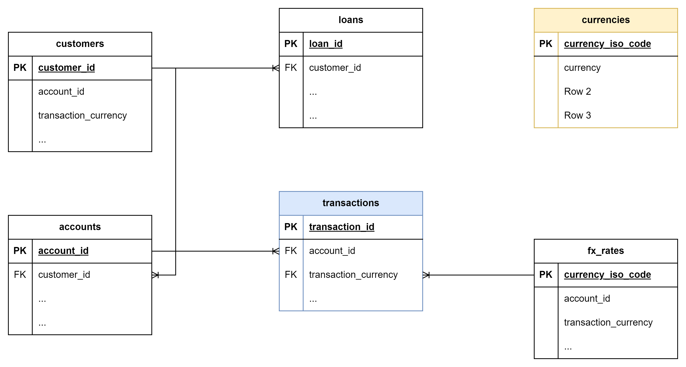

# Case Study at Varengold Bank AG - Data Engineering

## Introduction

The following changes are made:
- For all the fixes, constraints, comments and tests see EXPLORATION.md
- Data enrichment with help of currencies.csv
- Implementation of incremental models for the intermediate layer (data warehouse). This is better than to use normal models because we can build a history. 
- New model in the reporting layer
- Created sql tests for the models in the intermediate and reporting layer 
- The data catalog is stored in the folder data/catalog.json. Link to show it in github is here https://eddieknuthprivate.github.io/dbt-case/#!/overview

Have a nice day,
Eddie Knuth

[Contact me](mailto:eddie.knuth@t-online.de)

### ERD (DuckDB: raw)

The entity-relationship diagram shows how the individual source tables are related to each other.

